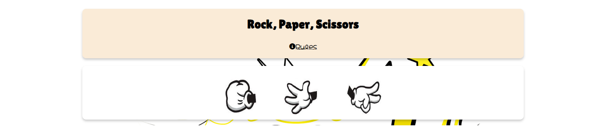
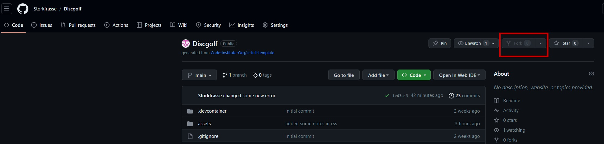

# **Rock Paper Scissors**

Rock, Paper, Scissors. Is a simple game there you meet a computer.

Welcome to <a href="https://storkfrasse.github.io/Project2/" target="_blank" rel="noopener">Rock, Paper, Scissors</a>

# Contents

- [**Rock, Paper, Scissors**](#Rock Paper Scissors)
- [Contents](#contents)
- [User Experience](#user-experience)
  - [User Stories](#user-stories)
  - [Site Structure](#site-structure)
  - [Design Choices](#design-choices)
- [Features](#features)
  - [Existing Features](#existing-features)
  - [Future Features](#future-features)
- [Technologies Used](#technologies-used)
- [Testing](#testing)
- [Deployment](#deployment)
  - [**To deploy the project**](#to-deploy-the-project)
  - [**To fork the repository on GitHub**](#to-fork-the-repository-on-github)
  - [**To create a local clone of this project**](#to-create-a-local-clone-of-this-project)
- [Credits](#credits)
  - [Content](#content)
  - [Media](#media)
- [Acknowledgements](#acknowledgements)

# User Experience

## User Stories

- As a user I want to be able to read the rules.
- As a user I want to play the game.
- As a user I want to know won the round.
- As a user I want to see and reset the score.

[Back to top](<#contents>)

## Site Structure

Rock paper scissors is single page website, with an pop-up box for rules

[Back to top](<#contents>)

## Design Choices

- ### Typography

      The fonts chosen were 'Lilita One' for the headings and 'Hachi Maru pop' for the body text.  
  - 'Lilita One' was chosen for the headings because i thought i was more fitting as a heading font
  - 'Hachi Maru pop' is used for the rules text and score text (body).

- ### Color Scheme

      I used Antique white and whit mainly so the users eye won't work to hard. the Celestial Blue is for future features.
 

[Back to top](<#contents>)

# Features

	The idea of this website is to people to make a stop and just enjoy them self with an easy and funny game. 

## Existing Features  

 - Rock, Paper Scissors.

[Back to top](<#contents>)

## Future Features

- I would like to make another game.

[Back to top](<#contents>)

# Technologies Used

- [JavaScript](https://https://www.w3schools.com/whatis/whatis_js.asp) - provides the function for the site.
- [HTML5](https://html.spec.whatwg.org/) - provides the content and structure for the website.
- [CSS](https://www.w3.org/Style/CSS/Overview.en.html) - provides the styling.
- [Github](https://github.com/) - used to host my website.
- [Codeanywhere](https://app.codeanywhere.com) - used to build and edit my website.

[Back to top](<#contents>)

# Testing

Please refer to [**_here_**](TESTING.md) for the testing results.

[Back to top](<#contents>)

# Deployment

### **To deploy the project**

The site was deployed to GitHub pages. The steps to deploy a site are as follows:

  1. In the GitHub repository, navigate to the **Settings** tab.
  2. Once in Settings, navigate to the **Pages** tab on the left hand side.
  3. Under **Source**, select the branch to **main**, then click **save**.
  4. Once the main branch has been selected, the page will be automatically refreshed with a detailed ribbon display to indicate the successful deployment.

  The live link to the Github repository can be found here - <https://github.com/Storkfrasse/Project2>

### **To fork the repository on GitHub**

A copy of the GitHub Repository can be made by forking the GitHub account. This copy can be viewed and changes can be made to the copy without affecting the original repository. Take the following steps to fork the repository;

1. Log in to **GitHub** and locate the [repository](https://github.com/Storkfrasse/Discgolf).
2. On the right hand side of the page inline with the repository name is a button called **'Fork'**, click on the button to create a copy of the original repository in your GitHub Account.

### **To create a local clone of this project**

The method from cloning a project from GitHub is below:

1. Under the repository’s name, click on the **code** tab.
2. In the **Clone with HTTPS** section, click on the clipboard icon to copy the given URL.

1. Go to [Codeanywhere](https://app.codeanywhere.com) Log in with GitHub
2. Press the **+** New Workspace

3. Paste the link.
4. Press **enter** and the local clone will be created.

[Back to top](<#contents>)

# Credits

### Content

- The font came from [Google Fonts](https://fonts.google.com/).
- The icons came from [Font Awesome](https://fontawesome.com/).
- The text in the home pages is from [Google](https://google.com).
- Color scheme [Cssgradient.io](https://cssgradient.io).

### Media

- The Hero picture is form [pngtree](https://pngtree.com).
- The image for rock, paper, scissors is from [Google picture search](https://google.com).
- To compress picture is used [iloveimg](https://iloveimg.com)

[Back to top](<#contents>)

# Acknowledgements

The site was completed as a Portfolio 2 Project piece for the Full Stack Software Developer at the [Code Institute](https://codeinstitute.net/). As such I would like to thank my mentor Rory Patrick Sheridan.

Michael Sjö 2023.

[Back to top](<#contents>)
  