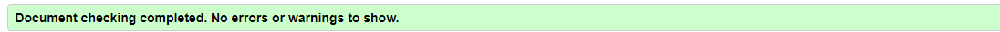
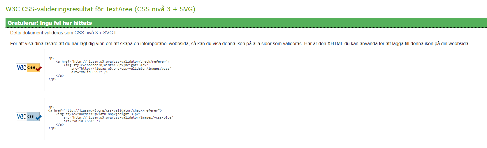
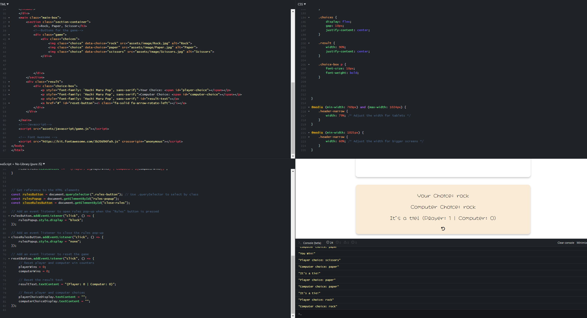
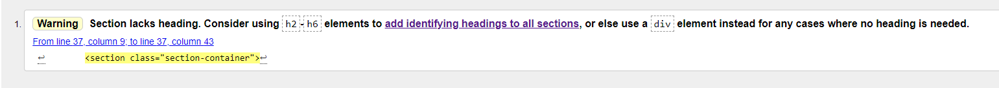
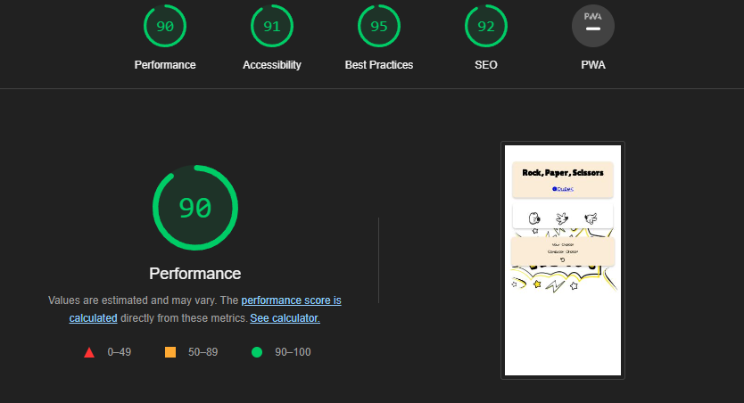

# Testing

## Code Validation

My Rock Paper Scissors website has be tested. All the code has been run through the [W3C html Validator](https://validator.w3.org/), [W3C CSS Validator](https://jigsaw.w3.org/css-validator/), [JSHint](https://jshint.com) and [JSFiddle.net](https://jsfiddle.net).

The HTML validator results for each page are below:

* Index page

The CSS validator results are below:

The JSfiddle results are below:

## Responsiveness Test

* The responsive design tests with [Google Chrome DevTools](https://developer.chrome.com/docs/devtools/) and [Responsive Design Checker](https://www.responsivedesignchecker.com/).

|        | Galaxy fold | iPhone 5 | iPad | iPad Pro | Display <1200px | Display >1200px |
|--------|-------------|----------|------|----------|-----------------|-----------------|
| Render | pass        | pass     | pass | pass     | pass            | pass            |
| Images | pass        | pass     | pass | pass     | pass            | pass            |
| Links  | pass        | pass     | pass | pass     | pass            | pass            |

## Browser Compatibility

This website was tested on the following browsers.
Google Chrome, Microsoft Edge and Mozilla Firefox. Appearance, functionality and responsiveness were consistent.

## Testing User Stories

* As a user I want to be able to read the rules.
  * It's easy to find the rules button.
     
* As a user I want to play the game.
  * There is tree icons, Rock hand, Paper hand and Scissors hand.
     
* As a user I want to know won the round.
  * In the bottom box there you can see the score and who won the round.
     
    
* As a user I want to see and reset the score.
  * There is a reset buttom under the score

## Known Bugs

* ### Resolved

  * During validation one bug became known during the validation stage, a brief description is below:

  * Contact page -
    
This Warning that i did't have a heading, i sorted that out by adding a h3 and made it not to show.

## Additional Testing

There were minor spelling and grammar errors that have since been fixed.

### Lighthouse Test

* The Lighthouse test shows 90 out of 100.

Back to [README.md](./README.md#testing).
